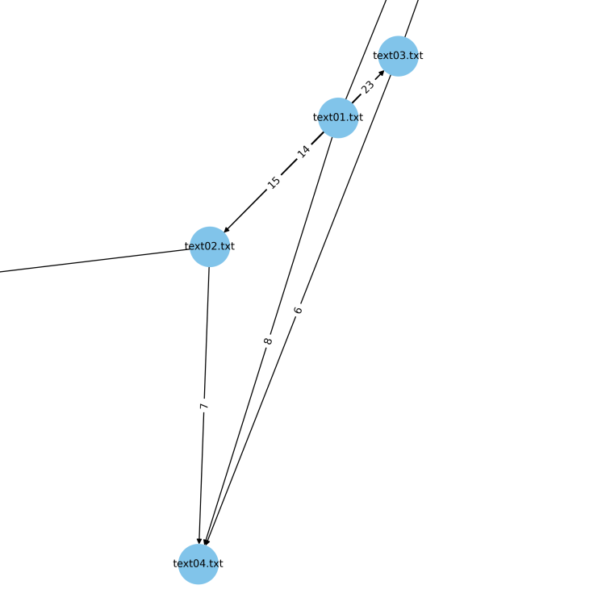

## TRACE - Text Reuse Analysis and Comparison Engine


TRACE is a simple Python script that compares the similarities between different text files (even multilingual) using two methods: MinHash and SentenceTransformer. It allows you to specify the directory containing the text (txt) files, the size of the text windows to compare, the step size to move for each new window, and the similarity threshold. It also creates a network graph (_text_similarity_network.gexf_) of the text similarities to see the relations of the different texts. The result of the analytics is stored in a json file (_result.json_)


### USAGE

The script takes the following arguments:

- **model** (required): The method to use to compare the texts. Must be either "minihash" or "sentencetransformer".
- **model_type**: If you're using the sentencetransformer (default: paraphrase-multilingual-MiniLM-L12-v2).
- **directory** (required): The directory containing the text files to compare.
- **window_size**: The size of each text window. Defaults to 100. Increasing the window size increases the size of the text chunks being compared. A smaller window size may lead to more granular comparison, while a larger window size might lead to more generalized comparison.
- **step_size**: The step size to move for each new window. Defaults to 50.  A smaller step size means more overlap between consecutive windows and more comparisons, leading to potentially higher precision but slower computation. A larger step size means less overlap and fewer comparisons.
- **ngram_size**: The size of each n-gram, if you're using the MinHash method. Defaults to 3. Larger n-gram sizes may capture more context but might be less sensitive to small changes, while smaller n-gram sizes might be more sensitive but less context-aware.
- **similarity_threshold**: The threshold for considering two texts to be similar. Defaults to 0.7. 
Increasing the threshold will result in fewer but potentially higher quality similarities

#### Minihash
```python
python trace.py --model minihash --directory texts/ --ngram_size 5 --similarity_threshold 0.8
```
##### result.json (sample)
```json
    {
        "minhash_similarity": 0.9921875,
        "text1_filename": "text06.txt",
        "text1_text": " The perception of inherent tensions between justice and injustice (or the disproportion of good and",
        "text1_window_start": 0,
        "text2_filename": "text08.txt",
        "text2_text": "The perception of inherent tensions between justice and injustice (or the disproportion of good and ",
        "text2_window_start": 0
    },
```
#### Transformer (multilingual paraphrase)
```python
python trace.py --model sentencetransformer --directory texts/ --window_size 100 --step_size 100 --similarity_threshold=0.8
```
##### result.json (sample)
```json
 {
        "similarity": 0.8367198705673218,
        "text1_filename": "text01.txt",
        "text1_text": "y were perfectly normal, \nthank you very much. They were the last people you’d \nexpect to be involve",
        "text1_window_start": 100,
        "text2_filename": "text02.txt",
        "text2_text": "ass sie völlig normal waren, \nVielen Dank. Sie waren die letzten Menschen, von denen man \nin etwas S",
        "text2_window_start": 100
    },
```

Different SentenceTransformer models may produce different results depending on the specific characteristics of the text. Some models may work better with certain languages or domains. For pre-trained models, see [S-BERT page](https://www.sbert.net/docs/pretrained_models.html) and [Huggingface](https://huggingface.co/models?pipeline_tag=sentence-similarity&sort=trending)

## Network graph
The generated GEXF file can be opened by a variety of graph visualization software, such as [Gephi](https://gephi.org/), [Cytoscape](https://cytoscape.org/), and [Orange](https://orangedatamining.com/widget-catalog/networks/networkanalysis/). These applications allow you to view the network data as a graph, and to explore the relationships between the nodes and edges. However, the script also generates a preliminary visualization picture (text_similarity_network.png)



